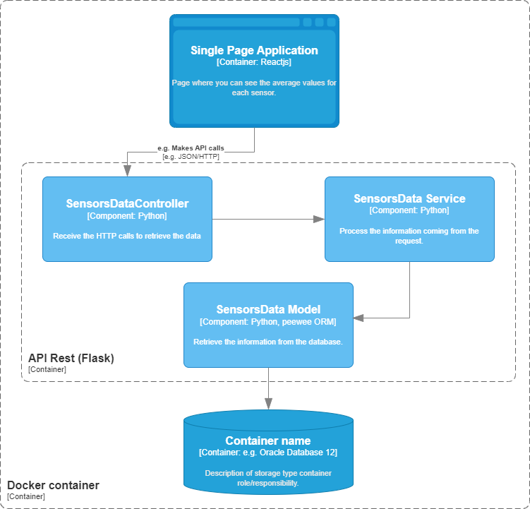

# Sensors

Esta solução é composta por uma banco de dados PostgreSQL, um backend Flask com três endpoints e uma página feita com React onde é possível ver os valores médios de cada sensor nas últimas 24 horas, 48 horas, 1 semana ou 1 mês e também fazer o upload de dados.

# Como rodar a solução

Você terá que preencher as variáveis `POSTGRES_USER` e `POSTGRES_PASSWORD` no arquivo `.env`. Também será necessário ter o [Docker](https://www.docker.com/) instalado em sua máquina. Tendo isso, basta executar:

`docker-compose up -d --build`

Depois disso a aplicação deve iniciar, e você pode acessar o frontend indo para http://localhost:3000. Se quiser acessar o swagger da api, pode ir para http://localhost:5000/.